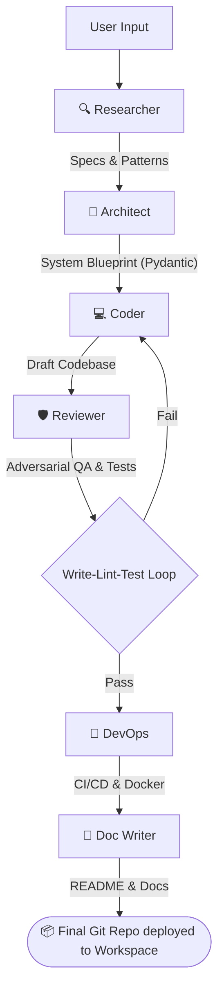

<div align="center">

# 🚀 CodeCrew

**Multi-Agent AI Code Generator**

Turn natural-language task descriptions into **complete, working codebases** — complete with READMEs, tests, and standard Git repositories. Powered by a robust CrewAI backend and visualized through a high-end Next.js Web UI.

[](#)
[](#)
[](#)
[](#)

> *"build a full-stack Next.js app with auth and PostgreSQL"* → **Full source code + tests + README + Git repo ✨**

</div>

---

## ✨ Key Features

CodeCrew isn't just a prototype generator—it's designed to output production-grade code by mitigating hallucination and enforcing strict workflows.

- 🧠 **Multi-Agent Architecture**: Six specialized agents (Researcher, Architect, Coder, Reviewer, DevOps, and Doc Writer) run sequentially.
- 🧱 **Structured Pydantic Handoffs**: Agents communicate using strict schema definitions, completely eliminating ambiguity and placeholder code.
- 🔄 **Automated Execution Loop**: A built-in *write-lint-test-retry* cycle ensures the code actually works before the job finishes.
- 🛡️ **Adversarial QA**: A dedicated, rigorous Reviewer agent actively tries to break the Coder's output to find edge cases.
- 🎨 **Glassmorphic Web UI**: A stunning Next.js 14 frontend with TailwindCSS, Framer Motion, and SSE streaming for live terminal reflections of agent thought processes.
- 🔌 **Universal Model Routing**: Easily swap between leading local models (DeepSeek, Qwen2.5, Llama 3.3 via Ollama or `llama.cpp`) and Cloud APIs (Groq, Cerebras, Gemini, OpenAI, Anthropic).
- ☁️ **Cloud GPU Offloading**: Native instructions to offload heavy inference to free Kaggle T4 GPUs via Ngrok, perfect for hardware-constrained setups.

---

## 🏗️ The Agent Pipeline



---

## 🎨 Next.js Web UI

CodeCrew features a premium, responsive frontend built with TailwindCSS and Framer Motion to visualize jobs in real time.

1. Navigate to the frontend directory: `cd frontend`
2. Install dependencies: `npm install`
3. Start the dev server: `npm run dev`
4. Open [http://localhost:3000](http://localhost:3000)

The Next.js API routes automatically proxy background Python execution logs as SSE streams to a beautiful, dark-themed terminal UI.

---

## ⚡ Quick Start

### 1. Prerequisites
- **Python 3.10+**
- **Node.js 18+** (for UI)
- Local LLM engine (`ollama` or `llama.cpp`) OR Cloud Provider Keys.

### 2. Environment Setup

```bash
# Clone & enter project
git clone https://github.com/yourusername/CodeCrew.git
cd CodeCrew

# Create a virtual environment
python -m venv .venv

# Activate environment
.venv\Scripts\activate      # Windows
# source .venv/bin/activate # macOS/Linux

# Install the codecrew package
pip install -e .
```

### 3. Configuration

```bash
copy .env.example .env      # Windows
# cp .env.example .env      # macOS/Linux
```
Modify `.env` to configure your preferred model routing (*e.g., `LLM_PROVIDER=groq`, `LLM_PROVIDER=ollama`*).

### 4. Running Jobs

You can trigger generation from the Next.js UI or directly from the CLI:

```bash
# Basic run with default model
codecrew --task "build a CLI calculator in Python"

# Run with Human-in-the-Loop (prompts for approval between states)
codecrew --task "build a REST API with FastAPI" --human-override

# Override LLM provider specifically for this run
codecrew --task "create a weather dashboard" --provider exa --output-dir ./weather-app
```

---

## 🧠 Advanced Capabilities

### 🌟 Kaggle Free GPU Tunneling (Recommended for Low VRAM)
If your local machine has less than 8GB VRAM but you need to run large context models locally, use Kaggle's free T4 GPUs.
1. Spin up a Kaggle Notebook with a GPU T4 x2.
2. Install tools: `!curl -fsSL https://ollama.com | sh && !pip install pyngrok`
3. Expose via Ngrok and set your local `.env`:
   ```env
   LLM_PROVIDER=ollama
   OLLAMA_BASE_URL=https://<your-ngrok-url>.ngrok-free.app
   ```

### 🏎️ Local LLM Optimization (`llama.cpp`)
CodeCrew is highly tailored for `llama.cpp` efficiency. Flash Attention, KV Cache quantization, and customized Jinja chat templates for system prompt ingestion can easily be dialed in to run state-of-the-art Coder models (like Phi-3.5-mini-instruct) even on an entry-level 4GB VRAM GPU.

---

## 🔧 Supported Integrations

#### LLM Providers
| Provider | Setup | Key `LLM_PROVIDER` |
|----------|-------|--------------------|
| **Ollama** | Local / Kaggle Network | `ollama` |
| **Free HA** | Zero-cost fallback routing | `free_ha` |
| **Groq / Cerebras / Gemini** | High-speed cloud APIs | `groq` / `cerebras` / `gemini` |
| **OpenAI / Anthropic** | Paid cloud APIs | `openai` / `anthropic` |

#### Search / RAG Providers
| Provider | `SEARCH_PROVIDER` |
|----------|-------------------|
| **DuckDuckGo** (Free) | `duckduckgo` |
| **Tavily / Serper / Exa** | `tavily`, `serper`, `exa` |

---

## 🧪 Testing

The adversarial execution loop ensures most code is logically sound. For developing the CodeCrew core itself:
```bash
pip install -e ".[dev]"
pytest tests/ -v
```

---

## 📄 License
Released under the MIT License.
