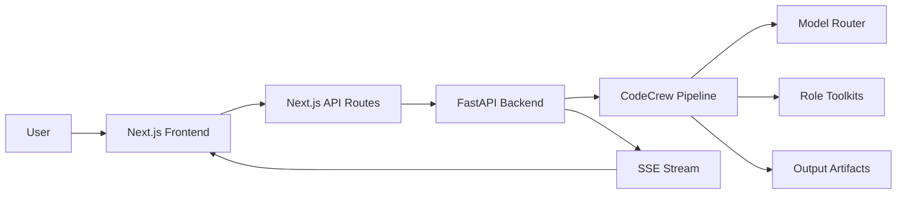
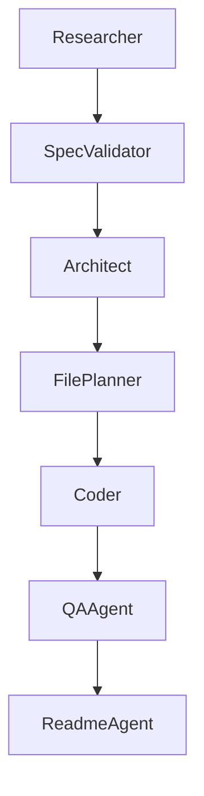

# Architecture

## High-Level System



## Pipeline Agent Graph



## Backend Component View

```mermaid
flowchart LR
  G[/POST api/generate/] --> JP[Job Queue]
  JP --> RJ[run_pipeline_job]
  RJ --> CS[CodeCrewPipeline]
  CS --> BM[build_role_models]
  RJ --> JS[job_state.json]
  RJ --> SSE[/GET api/jobs/{job_id}/stream/]
```

## Model Routing Strategy

- Reasoning lane for deep planning and architecture quality
- Coding lane for implementation-heavy steps
- Structured lane for deterministic output formats
- QA lane for adversarial review and fixes
- Fast lane for low-latency documentation/support outputs

## Security and Reliability Constraints

- File writes are constrained to output root
- Command execution is validated and time-bounded
- Job progress is persisted to disk for recovery
- Agent stages are explicit and observable
